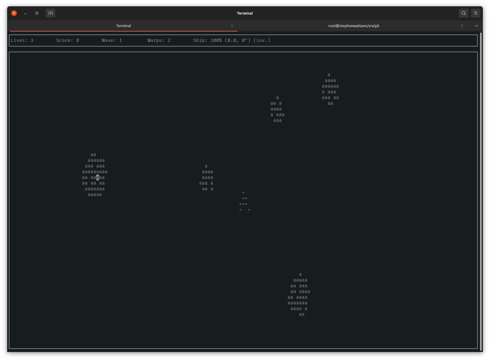

# Curses Asteroids
This is a simple asteroids game written in C using the curses library to render.  It samples bitmaps at different resolutions to render, so looks best in a huge terminal with tiny text.

## Build

    $ make

## Run

    $ ./as

### Controls
To control the ship, use the arrow keys (left, right turns and back/forward accelerates and decelerates).  To fire, press space.  To zoom in/out use `+` and `-`.  The `p` key pauses, and F1 quits.  Or just hit control-C.
